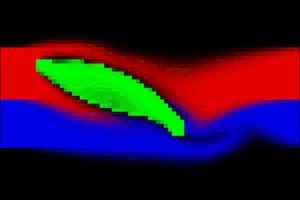

# Optimizing a Wing
Sam Greydanus

[Blog post](https://greydanus.github.io/2020/07/30/physics-of-flight/)

[Colab notebook](https://colab.research.google.com/drive/1RTsSyr7B3THKVGp_44Oyh7rxBriOHzJ7)

In this project, we obtain a wing by optimizing the lift/drag ratio of an occlusion in a simulated wind tunnel.

