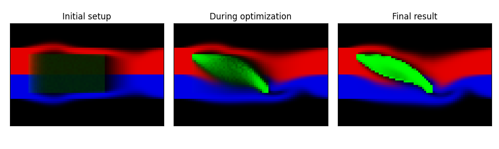

# Optimizing a Wing

[Paper](https://greydanus.github.io/2020/07/30/physics-of-flight/) | [Blog post](https://greydanus.github.io/2020/07/30/physics-of-flight/) | [Colab notebook](https://colab.research.google.com/drive/1RTsSyr7B3THKVGp_44Oyh7rxBriOHzJ7)

In this project, I use Navier-Stokes to simulate a wind tunnel, place a rectangular occlusion in it, and use gradient descent to optimize its lift/drag ratio. This gives us a wing shape. I'm releasing this repo as a supplement to a series of blog posts I wrote about human flight.

To obtain the figure below, clone this repo, `cd` into it, and run `python main.py `

Note: the code and ideas in this repo build on [this Autograd demo](https://github.com/HIPS/autograd/blob/master/examples/fluidsim/wing.png).